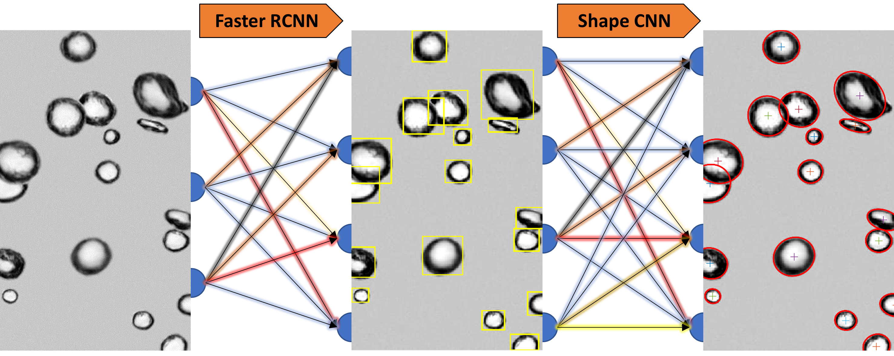

# BubCNN

 

	 
## Introduction

BubCNN is a bubble detection system which employs a pretrained Faster RCNN module to locate
bubbles and a pretrained shape regression CNN module to approximate the bubble shape by an
ellipse. It allows bubble detection without expert knowledge in digital image processing and
is applicable to a wide range of experimental setups.
If the results are not satisfying, use the transfer learning module to customize BubCNN to your 
images. Please share your transfer learning data to make future versions of BubCNN more general.
Program was tested for MATLAB 2019a. BubCNN requires the Deep Learning Toolbox. The transfer 
learning module requires the Deep Learning Toolbox and the Computer Vision Toolbox.

For more detailed information check the corresponding paper:
Tim Haas, Christian Schubert, Moritz Eickhoff and Herbert Pfeifer, BubCNN: Bubble detection using Faster RCNN and a shape regression network, Chemical Engineering Science 2020.

 <b>Update BubCNN v1.1:</b>
 -workaround in both programs to run in 2019b
 -bugfixing save/load button 
 -Updated Regression and Detection Module 
 -number of frames in Transfer Learning Module limited to 100 (->Speed up)

 Copyright (c) Institut für Industrieofenbau RWTH Aachen University  - All Rights Reserved
Unauthorized copying of this file, via any medium is strictly prohibited 
Proprietary and confidential
 Written by Tim Haas <haas@iob.rwth-aachen.de>, 2019
